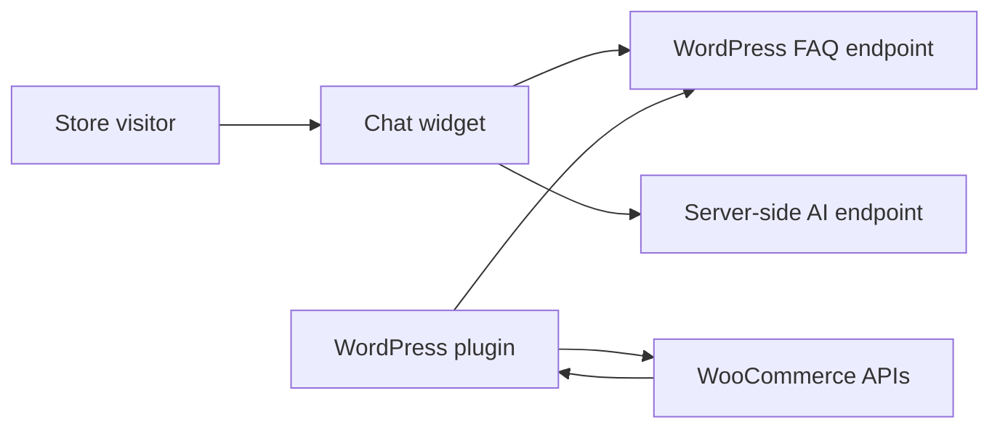

# WooCommerce AI Chatbot

A lightweight WordPress plugin that adds a bilingual support widget to a WooCommerce storefront and combines curated FAQ content with live, server-derived store information.

The repository demonstrates WordPress plugin architecture, REST endpoints, WooCommerce integration, client-side fuzzy search, localisation, and a controlled integration boundary for an external AI backend.

## Features

- configurable storefront chat widget,
- Polish and English FAQ datasets,
- local fuzzy search powered by Fuse.js,
- WordPress admin settings for workspace, locale, theme, endpoint, and logo,
- public read-only FAQ endpoint,
- WooCommerce-derived payment, shipping, currency, and bestseller context,
- server-side workspace integration without exposing provider credentials to the browser.

## Architecture

The widget first searches the local FAQ dataset. Questions not answered locally can be sent to the configured AI backend together with a public workspace identifier and a limited store snapshot.

## Security model

Provider API keys and WooCommerce credentials must remain server-side. They are not part of the browser configuration and should never be pasted into JavaScript, committed to Git, or returned by a public REST endpoint.

The current plugin exposes only public widget configuration and non-sensitive store context. Private model-provider authentication belongs in the configured backend.

## Installation

1. Download the repository or clone it.
2. Copy the plugin directory into `wp-content/plugins/qichatbot`.
3. Activate **WooCommerce AI Chatbot** in WordPress.
4. Open **QI Chatbot** in the WordPress admin menu.
5. Configure the workspace ID, locale, visual theme, backend endpoint, and optional logo.

## Development

The plugin uses standard WordPress and WooCommerce hooks and has no Node.js build step.

Main files:

- `qichatbot.php` — plugin bootstrap,
- `includes/class-qichatbot.php` — settings, REST routes, and WooCommerce context,
- `assets/js/qichatbot-widget.js` — storefront widget,
- `assets/json/faq-pl.json` and `faq-en.json` — editable FAQ data,
- `assets/js/fuse.min.js` — bundled third-party fuzzy-search library.

Before releasing a production build, run WordPress coding-standard checks, verify REST responses, and test the plugin against supported WordPress and WooCommerce versions.

## Status

**Portfolio reference / plugin prototype.** Production deployments should add durable backend rate limiting, abuse controls, monitoring, and a documented data-retention policy.

## Licensing

Original QI Chatbot code is available under the MIT License. Bundled Fuse.js remains under the Apache License 2.0. See [LICENSE](LICENSE) and [THIRD_PARTY_NOTICES.md](THIRD_PARTY_NOTICES.md).
